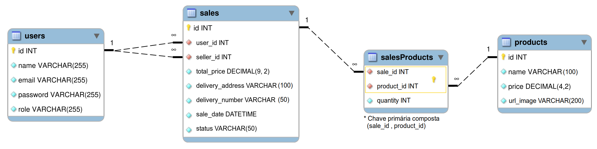

# Delivery App

Aplicação fullstack de delivery para uma distribuidora de bebidas: catálogo de produtos, carrinho, checkout e acompanhamento de pedidos, com três perfis de acesso — cliente, pessoa vendedora e administração.

> Projeto desenvolvido em equipe de 12 pessoas. Atuei principalmente no back-end (camadas de vendas e usuários, autenticação JWT e testes de integração) e na integração com o front-end, com 53 commits — o segundo maior volume de contribuições do time.

## Funcionalidades

**Cliente**
- Login e cadastro próprio
- Catálogo de produtos com carrinho e cálculo de total
- Checkout com escolha de pessoa vendedora e endereço de entrega
- Lista de pedidos e detalhe do pedido, com marcação de "recebido"

**Pessoa vendedora**
- Painel de pedidos recebidos
- Fluxo de status do pedido: pendente → preparando → em trânsito → entregue

**Administração**
- Cadastro de novas pessoas usuárias com definição de papel
- Listagem e exclusão de pessoas usuárias

## Stack

**Back-end** — Node.js · Express · Sequelize · MySQL · JWT · Joi/Zod para validação · Mocha, Chai e Sinon para testes

**Front-end** — React 17 · React Router 6 · Tailwind CSS · Axios · React Toastify

**Infra local** — PM2 para orquestrar as duas aplicações

## Arquitetura

O back-end segue o padrão MSC (Model–Service–Controller), com middlewares dedicados para autenticação e validação:

```
back-end/src/
├── api/            # app Express e bootstrap do servidor
├── controllers/    # tratamento de request/response
├── services/       # regras de negócio
├── database/
│   ├── models/     # models Sequelize
│   ├── migrations/
│   ├── seeders/
│   └── config/
├── middlewares/    # tokenAuth (JWT), validations
└── tests/          # testes de integração + mocks
```

O front-end concentra as chamadas HTTP em `src/services/api.js`, mantendo os componentes livres de detalhes de transporte.

## API

| Método | Rota | Descrição | Autenticação |
|---|---|---|---|
| `POST` | `/login` | Autentica e retorna token | — |
| `POST` | `/login/verify` | Valida um token existente | JWT |
| `POST` | `/users` | Cadastro de cliente | — |
| `POST` | `/users/admin` | Cadastro com papel definido | JWT + admin |
| `GET` | `/users` | Lista pessoas usuárias | JWT + admin |
| `GET` | `/users/sellers` | Lista pessoas vendedoras | JWT |
| `DELETE` | `/users/:id` | Remove pessoa usuária | JWT + admin |
| `GET` | `/products` | Lista produtos | JWT |
| `GET` | `/sales` | Lista todas as vendas | JWT |
| `POST` | `/sales` | Cria uma venda | JWT |
| `GET` | `/sales/:id` | Detalhe de uma venda | JWT |
| `GET` | `/sales/customer/:id` | Vendas de um cliente | JWT |
| `GET` | `/sales/seller/:id` | Vendas de uma pessoa vendedora | JWT |
| `PATCH` | `/sales/prepare/:id` | Marca como "preparando" | JWT |
| `PATCH` | `/sales/todeliver/:id` | Marca como "em trânsito" | JWT |
| `PATCH` | `/sales/delivered/:id` | Marca como "entregue" | JWT |

## Como rodar

**Pré-requisitos:** Node.js >= 16 e Docker (para o banco).

**1.** Crie os arquivos de ambiente:

```bash
cp back-end/.env.example back-end/.env && cp front-end/.env.example front-end/.env
```

**2.** Gere um `JWT_SECRET` e cole em `back-end/.env`:

```bash
openssl rand -hex 32
```

**3.** Suba o MySQL em container (aguarda o healthcheck ficar verde):

```bash
npm run db:up
```

**4.** Instale as dependências e rode migrations + seeds:

```bash
npm run dev:prestart
```

**5.** Suba as duas aplicações com PM2:

```bash
npm run dev
```

O front-end sobe em `http://localhost:3000` e a API em `http://localhost:3001`.

Para parar: `npm stop` (aplicações) e `npm run db:down` (banco). Os dados do MySQL ficam em um volume Docker e sobrevivem ao `db:down`.

> Se preferir usar um MySQL já instalado na máquina, pule o passo 3 e ajuste as credenciais em `back-end/.env`.

## Testes

```bash
npm run test:back
```

O back-end tem testes de integração cobrindo as camadas de Products, Sales e Users, com mocks do Sequelize via Sinon.

## Usuários de exemplo

As seeds criam os três perfis para navegação:

| Perfil | E-mail | Senha |
|---|---|---|
| Administração | `adm@deliveryapp.com` | `--adm2@21!!--` |
| Pessoa vendedora | `fulana@deliveryapp.com` | `fulana@123` |
| Cliente | `zebirita@email.com` | `$#zebirita#$` |

## Scripts

| Comando | O que faz |
|---|---|
| `npm run db:up` | Sobe o MySQL em container e aguarda ficar saudável |
| `npm run db:down` | Derruba o container do banco |
| `npm run db:logs` | Acompanha os logs do MySQL |
| `npm run dev` | Sobe back-end e front-end via PM2 |
| `npm run dev:prestart` | Instala dependências e prepara o banco |
| `npm stop` | Derruba os processos do PM2 |
| `npm run db:reset` | Recria o banco (drop, create, migrate, seed) |
| `npm run test:back` | Testes do back-end |
| `npm run lint` | Lint nas duas aplicações |

Os testes do back-end usam mocks do Sequelize e **não precisam do banco no ar**.

## Modelo de dados


